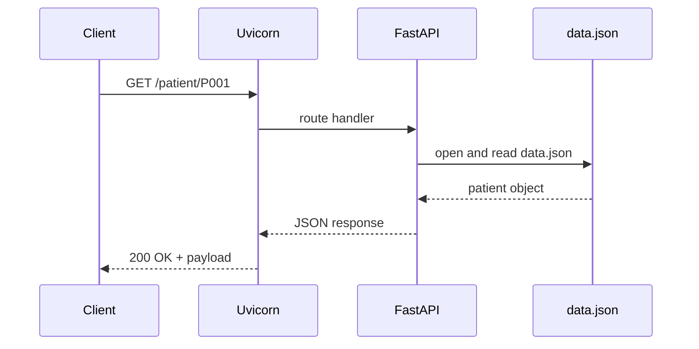

# Patient Management System — FastAPI

A minimal learning project that implements a Patient Management System API using FastAPI. The project stores patient records in a local JSON file and demonstrates core FastAPI concepts: routing, request/response handling, simple persistence, and API documentation.

## Table of contents
- [Quick summary](#quick-summary)
- [Architecture & flowcharts](#architecture--flowcharts)
- [Features implemented](#features-implemented)
- [Data model (current)](#data-model-current)
- [API endpoints & examples](#api-endpoints--examples)
- [Local setup (Windows)](#local-setup-windows)
- [Development notes & next steps to learn FastAPI](#development-notes--next-steps)
- [Testing & tooling](#testing--tooling)

## Quick summary
This mini project exposes a small REST API:
- Read-only endpoints to list and fetch patients.
- Data persisted in `data.json` as a mapping of patient IDs (e.g. `P001`) to patient objects.
- Simple server implementation in `main.py`.

## Architecture & flowcharts

Component diagram (Mermaid):

```mermaid
graph TD
  Client[Client (browser / curl / Postman)]
  API[FastAPI app<br/>(main.py)]
  Data[data.json]
  UV[Uvicorn ASGI server]
  Client -->|HTTP request| UV --> API
  API -->|read/write| Data
  API -->|openapi/docs| Client
```

Sequence (request to view one patient):



## Features implemented
- GET / — root message
- GET /about — short description
- GET /view — returns full `data.json`
- GET /patient/{patient_id} — returns a single patient by ID
- Simple JSON persistence (file-based)

## Data model (current)
The repository stores patients in `data.json`. Each patient ID maps to an object:

Example entry (from data.json)
```json
"P001": {
  "name": "Aarav Sharma",
  "city": "Delhi",
  "age": 28,
  "gender": "Male",
  "height_m": 1.75,
  "weight_kg": 72.0,
  "bmi": 23.5,
  "verdict": "Normal weight"
}
```

Notes:
- Top-level structure is a map/dict keyed by patient id (string).
- BMI and verdict are precomputed in the sample data.

## API endpoints & examples

1. Root
- GET /
- Example: curl http://127.0.0.1:8000/
- Response: {"message": "Patients Mangement System API"}

2. About
- GET /about
- Response: {"message":"A fully functional API for managing patients' data."}

3. View all
- GET /view
- Returns entire JSON file as {"data": { ... }}

4. Single patient
- GET /patient/{patient_id}
- Example: curl http://127.0.0.1:8000/patient/P001
- Response (200): {"patient": { ... }} or {"error": "Patient not found"}

Interactive docs:
- Open http://127.0.0.1:8000/docs (Swagger UI)
- Open http://127.0.0.1:8000/redoc (ReDoc)

## Local setup (Windows)
1. Create and activate virtual environment
```powershell
python -m venv myenv
.myenv\Scripts\activate
```

2. Install minimal dependencies
```powershell
pip install fastapi uvicorn
```

3. Run the server
```powershell
uvicorn main:app --reload --host 127.0.0.1 --port 8000
```

4. Test with curl (PowerShell):
```powershell
curl http://127.0.0.1:8000/patient/P001
```

## Development notes & next steps to learn FastAPI
Recommended improvements for learning and building the app:

- Use Pydantic models
  - Add request/response schemas in a `models.py` (validation, typing, examples).
- Add create/update/delete endpoints (POST /patients, PUT /patient/{id}, DELETE /patient/{id}).
- Move persistence behind a small service layer (functions to read/write) and lock file access if concurrent writes are possible.
- Replace file persistence with a lightweight DB (SQLite + SQLModel or SQLAlchemy) as you advance.
- Add request validation, errors using HTTPException and proper status codes.
- Explore dependency injection, background tasks, CORS, and authentication (OAuth2 / JWT).
- Add pagination & filtering for `/view`.

Short code examples to get started:
- Pydantic model skeleton
```python
from pydantic import BaseModel, Field
from enum import Enum

class Gender(str, Enum):
    Male = "Male"
    Female = "Female"

class Patient(BaseModel):
    name: str
    city: str
    age: int = Field(..., gt=0)
    gender: Gender
    height_m: float
    weight_kg: float
```

## Testing & tooling
- Use pytest for unit tests.
- Lint/format with flake8 / black / isort.
- Add a requirements.txt for reproducible installs:
```text
fastapi
uvicorn
pytest
```

## Troubleshooting
- If the server can't read `data.json`: ensure working directory is project root and file encoding is UTF-8.
- On Windows, activate the correct venv before running uvicorn.
- If you add write endpoints, beware of concurrent write collisions — prefer a DB for real applications.

## Suggested learning path (short)
1. Pydantic models → 2. CRUD endpoints → 3. DB integration → 4. Authentication → 5. Tests & CI

License: MIT

