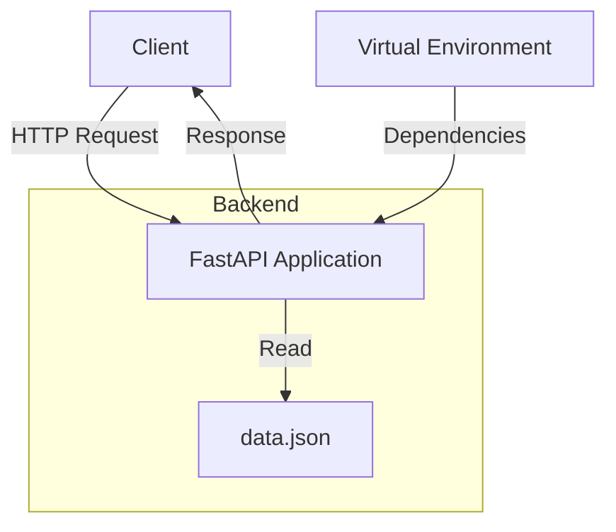

# FastAPI

A RESTful API service built with FastAPI for managing patient health records and BMI data.

## 📋 Table of Contents
- [Overview](#overview)
- [System Architecture](#system-architecture)
- [Features](#features)
- [Installation](#installation)
- [API Endpoints](#api-endpoints)
- [Data Structure](#data-structure)
- [Development](#development)

## 🔎 Overview

This project implements a Patient Management System using FastAPI framework, providing endpoints to manage and analyze patient health data including BMI calculations and weight status verdicts.

## 🏗 System Architecture



## ✨ Features

- RESTful API architecture
- JSON-based data storage
- Async request handling
- BMI calculation and weight status assessment
- Patient data management

## 🚀 Installation

1. Clone the repository
```bash
git clone <repository-url>
cd fastapi-patient-management
```

2. Create and activate virtual environment
```bash
python -m venv myenv
source myenv/Scripts/activate  # On Windows
```

3. Install dependencies
```bash
pip install fastapi uvicorn
```

4. Run the application
```bash
uvicorn main:app --reload
```

## 📡 API Endpoints

| Endpoint | Method | Description |
|----------|--------|-------------|
| `/` | GET | Root endpoint - Welcome message |
| `/about` | GET | Information about the API |
| `/view` | GET | Retrieve all patient records |

## 📊 Data Structure

Patient data follows this schema:

```json
{
    "Sn No": "string",
    "name": "string",
    "city": "string",
    "age": "integer",
    "gender": "string",
    "height_m": "float",
    "weight_kg": "float",
    "bmi": "float",
    "verdict": "string"
}
```

### BMI Categories

| BMI Range | Verdict |
|-----------|---------|
| < 18.5 | Underweight |
| 18.5 - 24.9 | Normal weight |
| 25.0 - 29.9 | Overweight |
| ≥ 30.0 | Obese |

## 💻 Development

The project uses the following technologies:

- FastAPI: Modern Python web framework
- Python 3.8+: Programming language
- JSON: Data storage
- Uvicorn: ASGI server

### Project Structure

```
fastapi-patient-management/
├── main.py           # Main application file
├── data.json         # Patient data storage
├── README.md         # Documentation
├── .gitignore       # Git ignore rules
└── myenv/           # Virtual environment
```

## 🔒 Environment Setup

The project uses a virtual environment to manage dependencies. Key dependencies include:

- fastapi==0.119.1
- uvicorn==0.38.0
- pydantic==2.12.3

## 🤝 Contributing

1. Fork the repository
2. Create a feature branch
3. Commit changes
4. Push to the branch
5. Open a Pull Request

## 📄 License

This project is licensed under the MIT License.

